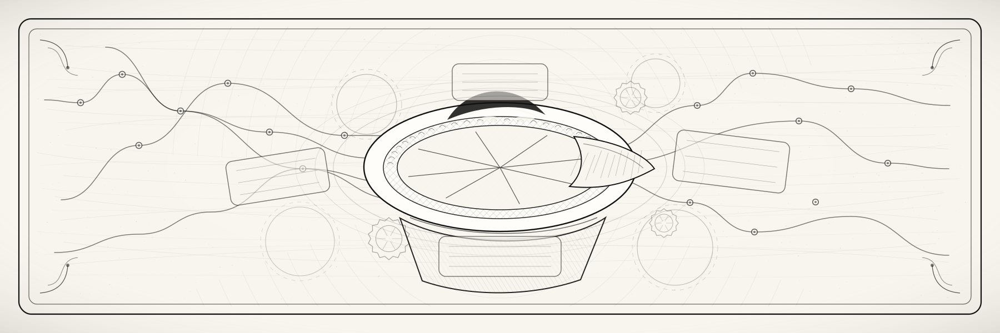

<div align="center">
  
</div>

<div align="center">

[](https://github.com/fiale-plus/pi-rogue/actions/workflows/check.yml) [](https://github.com/fiale-plus/pi-rogue/actions/workflows/check.yml) [](https://www.npmjs.com/package/@fiale-plus/pi-rogue) [](https://www.npmjs.com/package/@fiale-plus/pi-rogue) [](LICENSE)

</div>

# Pi-Rogue

**A command center for sharper Pi sessions.** Pi-Rogue adds the missing control layer around coding agents: route the right model, ask for strategic review at the right time, preserve exact context without flooding prompts, compare model panels, and keep long work anchored to explicit goals.

```bash
pi install npm:@fiale-plus/pi-rogue
```

One public package. One install. Explicit commands only.

## Why it exists

Pi-Rogue is built for agent sessions that should compound instead of drift:

- **Spend intelligence where it matters** — use router/advisor signals to escalate hard turns and stay lightweight for routine work.
- **Keep evidence retrievable** — large tool outputs become compact handles, not prompt sludge.
- **Compare before committing** — Fusion runs independent model attempts, judges them, then synthesizes a stronger answer.
- **Make autonomy visible** — goals, loops, and autoresearch are explicit, inspectable, and stoppable.

## Subsystems at a glance

Start with `/pi-rogue` for the cockpit, then jump into the subsystem you need.

| Subsystem | Command | What it gives you |
|---|---|---|
| **Pi-Rogue** | `/pi-rogue` | The cockpit: status, health checks, and pointers to every subsystem. Start here. |
| **Advisor** | `/pi-rogue-advisor` | Low-friction strategic review. A tiny local trained gate learns from examples when to escalate, then calls a strong advisor model only when the turn deserves it. |
| **Router** | `/pi-rogue-router` | Capability-aware routing telemetry and opt-in model switching. It is the multi-model layer: use whatever model fits the current turn or sequence instead of pretending one model is always best. |
| **Fusion** | `/pi-rogue-fusion` | OpenRouter-style model panels: independent analysis models answer the same task, a judge compares consensus/contradictions/blind spots, and a synthesis model writes the final answer. |
| **Goal / loop / autoresearch** | `/pi-rogue-orchestration` (or `/goal`, `/loop`, `/autoresearch`) | Visible session orchestration: define success, run periodic work, or start solo/parallel research flows without hidden budgets or background mystery. |
| **Context broker** | `/pi-rogue-context` | Bounded context memory for tool outputs, diffs, snapshots, subagent results, advisor briefs, and Fusion summaries. Prompts stay small; exact evidence stays one lookup away. |

## Quick start

```text
/pi-rogue status                         # cockpit: health and command pointers
/pi-rogue-advisor <question>             # ask for strategic guidance
/pi-rogue-router status                  # inspect route telemetry and mode
/pi-rogue-fusion configure               # create comparable-panel model recipes
/pi-rogue-orchestration goal set <goal>  # anchor long-running work
/goal set <goal>                         # shortcut for goal set
/pi-rogue-orchestration loop 5m <task>   # run an explicit periodic loop
/loop 5m <task>                         # shortcut for loop
/pi-rogue-context brief                  # see compact stored context handles
```

Router defaults to observe-only recommendations. `auto_model` is explicit and limited to future model switches; it does not spawn agents or mutate tools.

## What ships in the package

`@fiale-plus/pi-rogue` is the single consolidated public artefact. It bundles:

- `packages/advisor/` — advisor routing, binary gate, review/check-in behavior.
- `packages/router/` — local trajectory telemetry, model cards, training/evaluation workflows.
- `packages/context-broker/` — bounded broker runtime and `context_lookup` tool integration.
- `packages/fusion/` — composite model provider and recipe runner.
- `packages/orchestration/` — goal, loop, autoresearch, and lab primitives.
- `packages/core/` — shared contracts/helpers.

Workspace-only lab helpers live under `packages/lab/`; they are not part of the public single-install artefact.

## Command cheat sheet

| Surface | Common commands |
|---|---|
| Pi-Rogue | `/pi-rogue status`, `/pi-rogue help`, `/pi-rogue doctor` |
| Advisor | `/pi-rogue-advisor status`, `mode`, `model`, `review light\|strict\|off`, `<question>` |
| Router | `/pi-rogue-router status`, `mode observe`, `mode auto_model`, `profile <name>`, `models`, `configure` |
| Fusion | `/pi-rogue-fusion status`, `configure`, `reload` |
| Orchestration | `/pi-rogue-orchestration goal set/show/clear/list`, `/goal set/show/clear/list`, `/loop status/off/<interval> <instruction>`, `/autoresearch status/clear/<instruction>`, `/pi-rogue-orchestration lab status/clear/<instruction>` |
| Context | `/pi-rogue-context status`, `brief`, `lookup <handle\|text>`, `pin <handle>`, `export <handle>`, `prune` |

## Learn more

- [Canonical package README](packages/bundle/README.md) — install scope and bundled command surface.
- [Advisor README](packages/advisor/README.md) and [binary gate runbook](docs/routing-binary-gate.md) — escalation policy, trained gate, and evaluation workflow.
- [Router README](packages/router/README.md), [routing dataset workflow](docs/routing-dataset.md), and [routing labels](docs/routing-labels.md) — route telemetry and learning loop.
- [Context broker README](packages/context-broker/README.md) and [context footprint proposal](docs/context-footprint-broker.md) — prompt-safe artifact storage and lookup.
- [Fusion README](packages/fusion/README.md) and [skills-to-flow map](docs/skills-flow.md) — comparable-panel model composition and bounded usage rules.
- [Advisor Board agent/skill taxonomy](docs/advisor-board-agent-skill-taxonomy.md) — boundary between advisory agents, executable skills, and role Markdown.
- [Orchestration README](packages/orchestration/README.md) — goal, loop, autoresearch, and lab behavior.
- [Release guide](docs/release.md) — canonical `pi-rogue-<semver>` release process.

## Local development

```bash
npm install
npm run check
npm test
```

Legacy `.autoresearch` scratch data is archived at `~/.pi/archived-autoresearch/pi-rogue/`.

