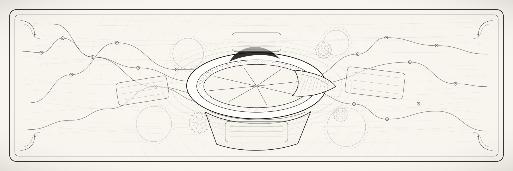

<div align="center">
  
</div>

<div align="center">

[](https://github.com/fiale-plus/pi-rogue/actions/workflows/check.yml) [](https://github.com/fiale-plus/pi-rogue/actions/workflows/check.yml) [](https://www.npmjs.com/package/@fiale-plus/pi-rogue) [](https://www.npmjs.com/package/@fiale-plus/pi-rogue) [](LICENSE)

</div>

# Pi-Rogue

**Explicit advisory help for sharper Pi sessions.** Pi-Rogue adds one bounded Advisor and a read-only Advisor Board to a Pi session. Normal work stays normal: Pi-Rogue does not make model calls, rewrite prompts, switch models, dispatch workers, or run background loops unless you explicitly ask for advice.

```bash
pi install npm:@fiale-plus/pi-rogue
```

One public package. One install. Explicit commands only.

Supported host: Pi `>=0.80.6 <0.81.0` on Node.js `>=22.19.0`.

## What it provides

- **Advisor** — one-shot senior engineering advice through an explicit command or tool call.
- **Advisor Board** — bounded, read-only specialist and Head-of-Board calls over a compact session ledger.
- **Core** — shared filesystem, storage, text, and safety helpers used by the bundled extension.

The Board has five static specialist lenses:

| Role | Focus |
|---|---|
| `reviewer` | Scope, correctness, regressions, tests, and maintainability |
| `security` | Secrets, trust boundaries, command/file safety, and authorization |
| `architecture` | Ownership, coupling, lifecycle, and API/state design |
| `debugger` | Reproduction, root cause, edge cases, and verification |
| `reliability-perf` | Hangs, retries, resource growth, repeated work, and concurrency |

Specialists are read/search-only and suggest-only by default. They can return findings and recommendations, never edits or commands. Head-of-Board is an explicit, bounded, read-only synthesis call; it cannot dispatch a specialist or mutate the workspace.

## Quick start

```text
/pi-rogue status
/pi-rogue-advisor <question>
/pi-rogue-advisor settings
/pi-rogue-advisor model list
/pi-rogue-advisor board specialist ask reviewer inspect the proposed change for regressions
/pi-rogue-advisor board head ask what decision is safest before merging
```

The `advisor` tool is also explicit: invoke it when you want advice, rather than relying on lifecycle hooks. `/pi-rogue status|help|doctor` and `/pi-rogue-advisor status|settings|model|board ...` are the only command roots registered by the package.

## Model map and bounds

Advisor model selection is separate from Pi's active model. The user-visible configuration has this shape:

```json
{
  "models": {
    "advisor": null,
    "specialist": null,
    "head": null
  },
  "board": {
    "specialists": "suggest",
    "maxSpecialistCalls": 3,
    "specialistMaxTokens": 900,
    "headMaxTokens": 1200
  }
}
```

`null` selects one authenticated compatible text model using the bounded preference for that role. `/pi-rogue-advisor model list [advisor|specialist|head]` shows available candidates, role recommendations, and declared reasoning/context/cost facts without making an LLM call. The explainable policy is quality-balanced Advisor, efficient specialists, and reasoning/context-oriented Head—not a universal quality ranking. An explicit `<provider>/<model>` value overrides discovery and is warned about if unavailable. Resolution attempts the configured model and at most one preferred fallback—never an unbounded provider loop. Model selection never changes Pi's global active model.

## Explicit-only safety boundary

Normal session lifecycle events do not call models. Pi-Rogue has no automatic review, check-in, routing, model switching, prompt rewriting, context database, Fusion/panel calls, orchestration loops, or background workers. An explicit Advisor, specialist, or Head call is bounded by its configured token/time/call limits and fails closed for unavailable models, oversized or unsanitized input, disallowed roles, and mutating tools. Results are suggestions only; they do not suppress work, retry themselves, or trigger another call.

## Package and development

`@fiale-plus/pi-rogue` is the canonical single public artifact. It bundles `@fiale-plus/pi-core` and the internal `@fiale-plus/pi-rogue-advisor` package; direct Advisor releases remain paused and are not a separate user install path.

```bash
npm install
npm run check
npm test
npm run test:packed-min-node
```

## Learn more

- [Canonical package README](packages/bundle/README.md) — install scope, model map, and command surface.
- [Advisor README](packages/advisor/README.md) — explicit calls, Board roles, and safety limits.
- [Advisor Board taxonomy](docs/advisor-board-agent-skill-taxonomy.md) — static roles and permission boundaries.
- [Advisor Board replay PoC](docs/advisor-board-poc.md) — bounded ledger/replay evidence model.
- [Release guide](docs/release.md) — canonical `pi-rogue-<semver>` release process and legacy tombstones.
